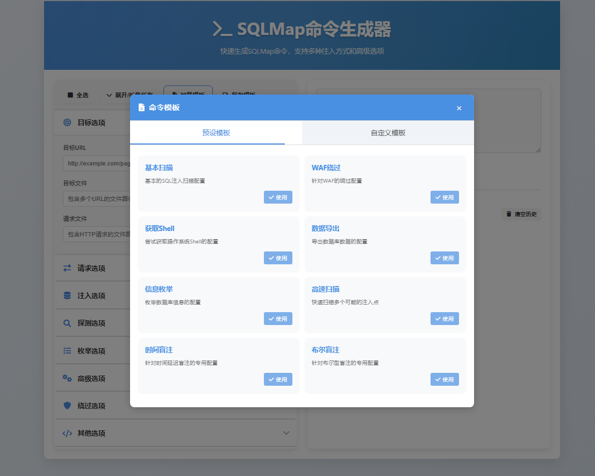

# SQLMap Studio

[](https://opensource.org/licenses/MIT)
[](https://github.com/xinyikan/sqlmap-studio)
[](https://github.com/xinyikan/sqlmap-studio/pulls)

SQLMap Studio 是一个现代化的 Web 界面工具，专为生成和配置 SQLMap 命令而设计，帮助安全研究人员和渗透测试人员高效执行 SQL 注入测试。



## 📑 目录

- [主要特性](#主要特性)
- [安装](#安装)
- [使用指南](#使用指南)
- [命令选项](#命令选项)
- [预设模板](#预设模板)
- [安全提示](#安全提示)
- [技术栈](#技术栈)
- [未来规划](#未来规划)
- [贡献指南](#贡献指南)
- [许可证](#许可证)

## ✨ 主要特性

- **直观的用户界面**：更加现代化的界面，让 SQL 注入测试变得简单
- **全面的参数支持**：覆盖 SQLMap 的全部核心功能和选项
- **模板系统**：
  - 内置多套专业测试模板
  - 自定义模板的保存与加载
- **命令历史**：自动保存生成的命令，便于重复使用
- **实时预览**：即时生成和预览 SQLMap 命令
- **响应式设计**：完美支持桌面和移动设备
- **本地应用**：纯前端实现，无需服务器，保护您的隐私

## 🚀 安装

SQLMap Studio 是一个纯前端应用，安装简单快捷：

```bash
# 克隆仓库
git clone https://github.com/xinyikan/sqlmap-studio.git

# 进入项目目录
cd sqlmap-studio

# 直接在浏览器中打开，无需构建
open index.html
```

### 部署选项

1. **本地使用**：直接在浏览器中打开 `index.html` 文件
2. **服务器部署**：将文件复制到任何 Web 服务器（Apache、Nginx 等）
3. **GitHub Pages**：可直接部署到 GitHub Pages 使用

## 📖 使用指南

### 基本操作

1. 在左侧面板展开 **目标选项** 部分，设置测试目标
2. 根据需要配置其他参数（请求、注入、探测等选项）
3. 点击 **生成命令** 按钮创建 SQLMap 命令
4. 使用 **复制命令** 按钮复制到剪贴板
5. 在终端中执行该命令

### 使用模板

1. 点击 **加载模板** 按钮打开模板选择界面
2. 从 **预设模板** 或 **自定义模板** 标签页中选择合适的模板
3. 点击对应模板的 **使用** 按钮应用设置
4. 根据需要调整参数后生成命令

### 保存自定义模板

1. 配置好所需的测试参数
2. 点击 **保存模板** 按钮
3. 填写模板名称和描述
4. 点击 **保存** 确认

### 命令历史

- 所有生成并复制的命令会自动保存在历史记录中
- 点击任何历史记录项可快速加载该命令
- 使用 **清除历史** 按钮可删除所有历史记录

## 🛠️ 命令选项

SQLMap Studio 提供的主要选项类别：

| 类别 | 说明 | 包含选项 |
|------|------|----------|
| 目标选项 | 定义测试目标 | URL、目标文件、请求文件 |
| 请求选项 | HTTP 请求配置 | 方法、数据、Cookie、User-Agent |
| 注入选项 | 注入技术配置 | 参数、DBMS、技术、查询、前后缀 |
| 探测选项 | 测试级别设置 | 级别、风险、线程数 |
| 枚举选项 | 数据获取配置 | 数据库、表、列、转储 |
| 高级选项 | 性能与控制 | 线程数、详细程度、批处理、超时 |
| 绕过选项 | WAF 绕过技术 | Tamper 脚本、WAF 识别、仅文本 |

## 📋 预设模板

SQLMap Studio 提供多种专业预设模板，包括：

- **基本扫描**：常规 SQL 注入测试的基础配置
- **WAF 绕过**：针对 Web 应用防火墙的专用配置
- **Shell 获取**：尝试获取操作系统 Shell 的配置
- **数据导出**：专注于数据库内容提取的配置
- **时间盲注**：针对时间延迟盲注的优化配置
- **报错注入**：利用数据库错误信息的注入配置
- **数据库专用模板**：针对 MySQL、MSSQL、Oracle、PostgreSQL 的优化配置

## ⚠️ 安全提示

- 本工具**仅供安全测试和教育目的**使用
- 在使用前**必须获得目标系统所有者的书面授权**
- 未经授权对系统进行测试可能违反法律法规
- 开发者不对任何非法使用本工具造成的后果负责

## 💻 技术栈

- **HTML5**：现代化结构
- **CSS3**：动画和响应式设计
- **原生 JavaScript**：无依赖，轻量高效
- **localStorage API**：本地数据持久化
- **Font Awesome**：图标库

## 🔮 未来规划

- [ ] 多语言支持（英语、西班牙语等）
- [ ] 命令验证和语法检查增强
- [ ] 导出/导入模板功能
- [ ] 与 SQLMap 直接集成，无需复制粘贴
- [ ] 结果解析和可视化展示
- [ ] 批量扫描任务管理
- [ ] 暗色模式优化

## 👥 贡献指南

欢迎通过以下方式为 SQLMap Studio 做出贡献：

1. Fork 本仓库
2. 创建功能分支 (`git checkout -b feature/amazing-feature`)
3. 提交更改 (`git commit -m 'Add some amazing feature'`)
4. 推送到分支 (`git push origin feature/amazing-feature`)
5. 开启 Pull Request

对于重大更改，请先开 issue 讨论您想要更改的内容。

## 📜 许可证

本项目采用 MIT 许可证 - 详情请参阅 [LICENSE](LICENSE) 文件

## 关于 SQLMap

SQLMap 是一个开源的渗透测试工具，用于自动化检测和利用 SQL 注入漏洞。
详细信息请访问 [SQLMap 官方 GitHub](https://github.com/sqlmapproject/sqlmap)。 